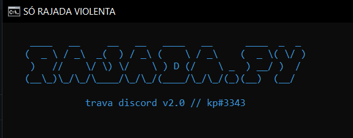
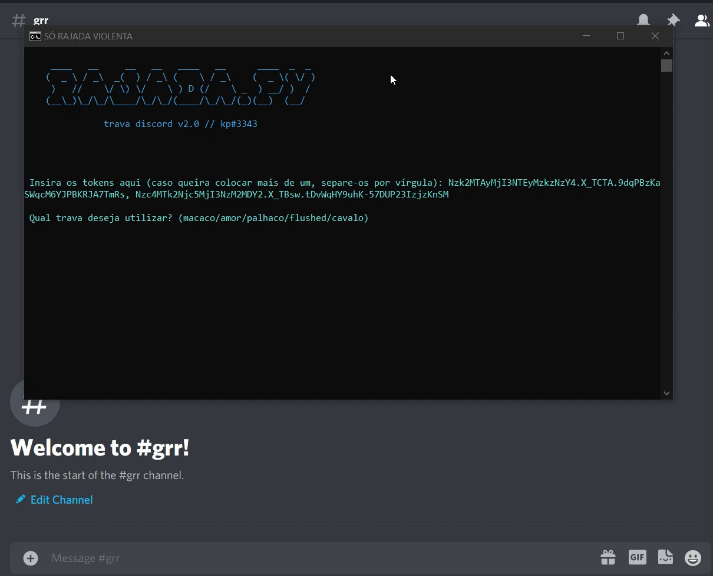

# rajada.py
Um script em Python que envia mensagens que travam discord

## Requerimentos
``pip install -r requirements.txt``

## FAQ
- É possível enviar travas na DM?
Sim, basta seguir as instruções de como pegar o ID do canal
- Tem como minha conta ser desabilitada por isso?
Sim, definitivamente. Se for fazer isso faça em uma conta secundária

## Como pegar tokens
Você pode utilizar o token que quiser, desde que tais contas tenham acesso ao chat em questão.

- Use o método que quiser, porém eu já fiz um [programa que pega os tokens disponíveis no seu computador](https://github.com/pedrokpp/automatic-token-getter), então sinta-se livre para usá-lo

Recomendações:
- Não utilize tokens do seus amiguinhos para travar os outros
- Utilize com sabedoria

## Como pegar ID de canal
Dessa forma não é necessário ativar opções de desenvolvedor
- Siga os passos deste gif:

## Erros comuns
- A conta deve estar no grupo/servidor em que deseja enviar os travas
- ID's errados (seguir tutorial de como não errar o ID)

## Features
* [x] Randomizar canais para enviar
* [x] Randomizar tokens (adicionado v2.0)
* [x] Múltiplas opções de trava
* [x] Contagem de mensagens enviadas (adicionado v2.0)
* [x] Mensagem personalizada (adicionado v2.1)

## Observação
Parece que o Discord deu patch no bypass de 2000 caracteres através de requests, porém a quantidade imensa de emojis ainda trava independentemente da limitação.

## Exemplo de modo de uso
- Os tokens usados nesse exemplo são de contas criadas na data desse exemplo e não possuem relação com nenhuma pessoa específica

